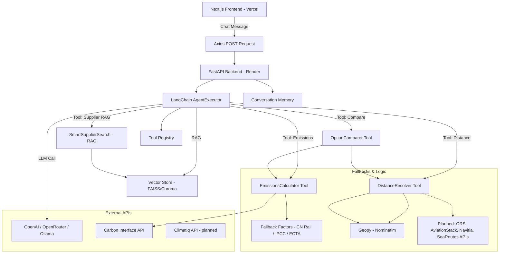

```mermaid
graph TD
    A[Next.js Frontend - Vercel] -->|Chat Message| B[Axios POST Request]
    B --> C[FastAPI Backend - Render]
    C --> D[LangChain AgentExecutor]
    D -->|RAG| E[Vector Store - FAISS/Chroma]
    D -->|LLM Call| F[OpenAI / OpenRouter / Ollama]
    D -->|Tool: Compare| G[OptionComparer Tool]
    D -->|Tool: Emissions| H[EmissionsCalculator Tool]
    D -->|Tool: Distance| I[DistanceResolver Tool]
    D -->|Tool: Supplier RAG| J[SmartSupplierSearch - RAG]
    %% D -->|Tool: Supplier DB| J2[SupplierSelector Tool (commented out)]

    C --> K[Conversation Memory]

    subgraph Fallbacks & Logic
        H --> H2[Fallback Factors - CN Rail / IPCC / ECTA]
        I --> I1[Geopy - Nominatim]
        I -.-> I2[Planned: ORS, AviationStack, Navitia, SeaRoutes APIs]
    end

    subgraph External APIs
        H1[Carbon Interface API]
        G1[Climatiq API - planned]
        I1
        F
    end

    H --> H1
    G --> H
    G --> I
    J --> E
    I --> I1
    D --> L[Tool Registry]
```