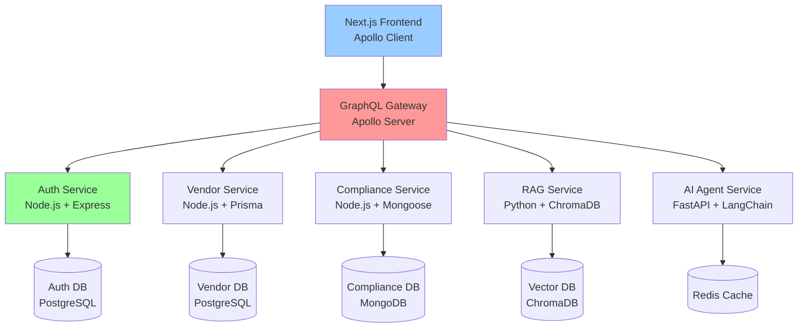
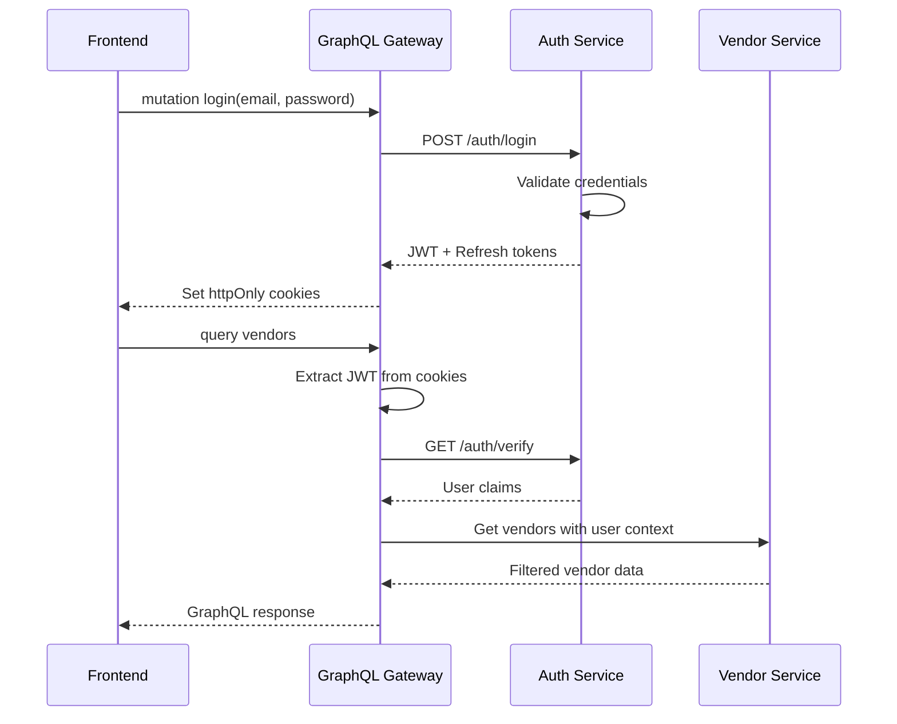

# GraphQL Gateway Migration Plan

## 🎯 Executive Summary

Transform the current ESG carbon footprint system from a direct FastAPI-to-Frontend architecture to a **GraphQL Gateway-centric microservices architecture** with enhanced authentication, scalability, and data management capabilities.

## 🏗️ Current System Analysis

### Existing Architecture
```
Next.js Frontend ──> FastAPI Backend (nzeroesg-api)
                          │
                          ├── LangChain ReAct Agent
                          ├── ChromaDB Vector Store
                          ├── External APIs (Carbon Interface)
                          └── In-memory Caching
```

### Current Components to Preserve/Migrate
- ✅ **LangChain AI Agent** → Keep as FastAPI service
- ✅ **ChromaDB Vector Store** → Migrate to dedicated RAG service
- ✅ **Supplier Data** → Migrate to PostgreSQL + MongoDB hybrid
- ✅ **Next.js Frontend** → Upgrade with Apollo Client
- ✅ **External API Integrations** → Keep in AI Agent service

## 🚀 Target Architecture



## 📋 Implementation Roadmap

### Phase 1: Foundation Setup (Weeks 1-2)
#### GraphQL Gateway
- Set up Apollo Server with Express
- Configure basic schema and resolvers
- Implement CORS and middleware pipeline
- Add request/response logging

#### Auth Service
- Create Node.js/Express auth microservice
- Set up PostgreSQL database for users/roles
- Implement JWT token generation and validation
- Add password hashing with bcrypt

### Phase 2: Data Layer Migration (Weeks 3-4)
#### PostgreSQL Setup
- Design vendor data schema with relationships
- Migrate supplier.json to PostgreSQL tables
- Implement Prisma ORM for type-safe queries
- Add data validation and constraints

#### MongoDB Setup
- Set up MongoDB for ESG compliance documents
- Design flexible schema for varied document types
- Implement Mongoose ODM
- Create indexing strategy for text search

### Phase 3: Service Development (Weeks 5-7)
#### Vendor Service
- Build GraphQL resolvers for vendor queries
- Implement CRUD operations with Prisma
- Add filtering, sorting, and pagination
- Integrate with auth middleware

#### RAG Service
- Extract ChromaDB logic from AI Agent
- Create dedicated Python service for embeddings
- Implement GraphQL-compatible API
- Add semantic search endpoints

#### AI Agent Adaptation
- Modify FastAPI service to work with GraphQL
- Update tool calling to use new data sources
- Implement JWT verification middleware
- Maintain LangChain ReAct framework

### Phase 4: Frontend Migration (Weeks 8-9)
#### Apollo Client Setup
- Replace Axios with Apollo Client
- Implement GraphQL queries and mutations
- Add authentication state management
- Create optimistic UI updates

#### Component Refactoring
- Update data fetching patterns
- Implement GraphQL fragments
- Add loading and error states
- Optimize with query caching

### Phase 5: Testing & Deployment (Weeks 10-12)
#### Integration Testing
- End-to-end auth flow testing
- GraphQL schema validation
- Performance benchmarking
- Security auditing

#### Deployment Strategy
- Docker containerization for all services
- Set up service discovery
- Configure load balancing
- Implement monitoring and logging

## 🗂️ Service Specifications

### GraphQL Gateway (Apollo Server)
```typescript
// Gateway Schema Overview
type Query {
  # Vendor queries
  vendors(filter: VendorFilter, pagination: PaginationInput): VendorConnection
  vendor(id: ID!): Vendor
  
  # AI Agent queries
  chatMessage(message: String!): AIResponse
  emissionsCalculation(input: EmissionsInput): EmissionsResult
  
  # Compliance queries
  complianceDocuments(vendorId: ID!): [ComplianceDocument]
}

type Mutation {
  # Auth mutations
  login(email: String!, password: String!): AuthPayload
  register(input: RegisterInput): AuthPayload
  
  # Vendor mutations
  createVendor(input: VendorInput): Vendor
  updateVendor(id: ID!, input: VendorInput): Vendor
}
```

### Auth Service (Node.js/Express)
```javascript
// Core Auth Endpoints
POST /auth/login          // Generate JWT tokens
POST /auth/register       // Create new user account
POST /auth/refresh        // Refresh JWT token
GET  /auth/verify         // Validate JWT token
POST /auth/logout         // Invalidate JWT token

// Database Schema (PostgreSQL)
users: id, email, password_hash, role, created_at
user_sessions: id, user_id, refresh_token, expires_at
roles: id, name, permissions
```

### Vendor Service (Node.js/Prisma)
```typescript
// Prisma Schema
model Vendor {
  id                    String   @id @default(cuid())
  name                  String
  region               String
  description          String?
  certifications       String[]
  materials            String[]
  transportModes       String[]
  carbonEmissions      Float
  deliveryTimeDays     Int
  esgRating           Float
  supportsOffset       Boolean
  contactEmail         String
  complianceDocuments  ComplianceDocument[]
  createdAt           DateTime @default(now())
  updatedAt           DateTime @updatedAt
}
```

### Compliance Service (Node.js/MongoDB)
```typescript
// MongoDB Collections
compliance_documents: {
  _id: ObjectId,
  vendorId: string,
  documentType: string, // 'iso_14001', 'b_corp', 'carbon_neutral'
  documentUrl: string,
  metadata: {
    expiryDate: Date,
    issuingAuthority: string,
    certificationLevel: string
  },
  content: string, // Full text for search
  createdAt: Date,
  updatedAt: Date
}
```

### AI Agent Service (FastAPI Enhancement)
```python
# JWT Middleware Integration
from fastapi import Depends, HTTPException
from fastapi.security import HTTPBearer

security = HTTPBearer()

async def verify_token(token: str = Depends(security)):
    # Verify JWT with Auth Service
    payload = jwt.decode(token.credentials, JWT_SECRET, algorithms=["HS256"])
    return payload["user_id"]

@router.post("/chat")
async def chat_endpoint(
    message: str,
    user_id: str = Depends(verify_token)
):
    # Enhanced agent with user context
    agent = await build_agent(user_id=user_id)
    return await agent.ainvoke({"input": message})
```

## 🔐 Authentication & Authorization Flow

### JWT Token Flow


### Role-Based Authorization
```typescript
// GraphQL Context with Auth
interface Context {
  user?: {
    id: string;
    email: string;
    role: 'admin' | 'vendor' | 'customer';
    permissions: string[];
  };
}

// Resolver with Authorization
const vendorResolvers = {
  Query: {
    vendors: async (parent, args, context) => {
      if (!context.user) throw new ForbiddenError('Not authenticated');
      
      // Filter based on user role
      if (context.user.role === 'vendor') {
        args.filter = { ...args.filter, ownerId: context.user.id };
      }
      
      return await vendorService.getVendors(args);
    }
  }
};
```

## 📊 Data Migration Strategy

### Phase 1: Supplier Data → PostgreSQL
```sql
-- Create vendor tables
CREATE TABLE vendors (
    id UUID PRIMARY KEY DEFAULT gen_random_uuid(),
    name VARCHAR(255) NOT NULL,
    region VARCHAR(100),
    description TEXT,
    certifications TEXT[],
    materials TEXT[],
    transport_modes TEXT[],
    carbon_emissions_per_kg DECIMAL(10,2),
    delivery_time_days INTEGER,
    esg_rating DECIMAL(3,1),
    supports_offset BOOLEAN DEFAULT false,
    contact_email VARCHAR(255),
    created_at TIMESTAMP DEFAULT NOW(),
    updated_at TIMESTAMP DEFAULT NOW()
);

-- Migration script from JSON
INSERT INTO vendors (name, region, description, ...)
SELECT 
    data->>'name',
    data->>'region',
    data->>'description',
    ...
FROM json_array_elements(suppliers_json) as data;
```

### Phase 2: ESG Documents → MongoDB
```javascript
// Migration script for compliance documents
const migrateComplianceData = async () => {
  for (const vendor of vendors) {
    if (vendor.certifications) {
      await ComplianceDocument.create({
        vendorId: vendor.id,
        documentType: 'certifications',
        content: vendor.certifications.join(', '),
        metadata: {
          certificationLevel: extractLevel(vendor.certifications)
        }
      });
    }
  }
};
```

## 🛠️ Development Guidelines

### GraphQL Best Practices
- Use DataLoader for N+1 query prevention
- Implement query depth limiting
- Add rate limiting per user/IP
- Use fragments for reusable field selections

### Error Handling
```typescript
// Standardized error responses
enum ErrorCode {
  AUTHENTICATION_FAILED = 'AUTHENTICATION_FAILED',
  INSUFFICIENT_PERMISSIONS = 'INSUFFICIENT_PERMISSIONS',
  VENDOR_NOT_FOUND = 'VENDOR_NOT_FOUND',
  AI_SERVICE_UNAVAILABLE = 'AI_SERVICE_UNAVAILABLE'
}

class CustomError extends Error {
  constructor(
    public code: ErrorCode,
    message: string,
    public statusCode: number = 400
  ) {
    super(message);
  }
}
```

### Testing Strategy
- Unit tests for each service
- Integration tests for GraphQL resolvers
- End-to-end tests for auth flows
- Performance tests for AI agent responses

## 🚀 Deployment & DevOps

### Docker Services
```yaml
# docker-compose.yml structure
services:
  graphql-gateway:
    build: ./graphql-gateway
    ports: ["4000:4000"]
    depends_on: [auth-service, vendor-service]
    
  auth-service:
    build: ./auth-service
    depends_on: [postgres]
    
  vendor-service:
    build: ./vendor-service
    depends_on: [postgres]
    
  compliance-service:
    build: ./compliance-service
    depends_on: [mongodb]
    
  ai-agent:
    build: ./nzeroesg-api
    depends_on: [redis, rag-service]
```

### Monitoring & Observability
- GraphQL query/mutation metrics
- Service-to-service communication tracing
- Auth service login/failure rates
- AI agent response times and accuracy

## ⚡ Performance Considerations

### Caching Strategy
- **GraphQL Gateway**: Query result caching with Redis
- **Vendor Service**: Database query caching
- **AI Agent**: Emissions calculation caching
- **Frontend**: Apollo Client normalized cache

### Optimization Points
- Implement GraphQL query batching
- Use database connection pooling
- Add CDN for static assets
- Optimize vector similarity search queries

## 🔧 Migration Timeline & Milestones

### Week 1-2: Foundation
- [ ] GraphQL Gateway basic setup
- [ ] Auth Service implementation
- [ ] PostgreSQL schema design

### Week 3-4: Data Layer
- [ ] Data migration scripts
- [ ] MongoDB setup for compliance
- [ ] Prisma/Mongoose integration

### Week 5-7: Services
- [ ] Vendor service with GraphQL resolvers
- [ ] RAG service extraction
- [ ] AI Agent authentication integration

### Week 8-9: Frontend
- [ ] Apollo Client implementation
- [ ] Component refactoring
- [ ] Authentication UI updates

### Week 10-12: Testing & Deployment
- [ ] Integration testing
- [ ] Performance optimization
- [ ] Production deployment

## 🎯 Success Metrics

- **Performance**: <200ms average GraphQL response time
- **Security**: Zero auth vulnerabilities in security audit
- **Scalability**: Handle 10x current user load
- **Developer Experience**: Reduced development time for new features
- **Data Integrity**: 100% successful data migration with validation

---

*This migration plan provides a robust foundation for scaling the ESG system while maintaining the core AI capabilities and adding enterprise-grade authentication and data management.*
