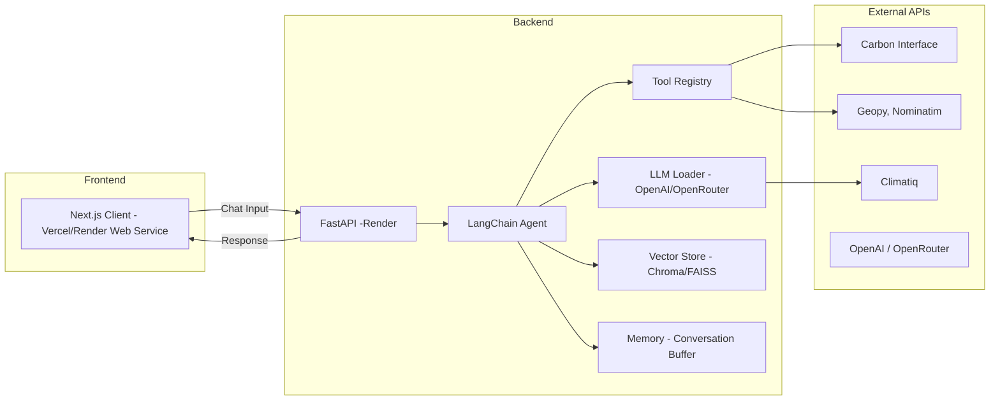

```mermaid
flowchart LR
    subgraph Frontend
        A[Next.js Client - Vercel/Render Web Service]
    end

    subgraph Backend
        B[FastAPI -Render]
        B1[LangChain Agent]
        B2[LLM Loader - OpenAI/OpenRouter]
        B3[Tool Registry]
        B4[Vector Store - Chroma/FAISS]
        B5[Memory - Conversation Buffer]
    end

    subgraph External APIs
        C1[Carbon Interface]
        C2[Geopy, Nominatim]
        C3[Climatiq]
        C4[OpenAI / OpenRouter]
    end

    A -->|Chat Input| B
    B --> B1
    B1 --> B2
    B1 --> B3
    B1 --> B4
    B1 --> B5

    B3 --> C1
    B3 --> C2
    B2 --> C3

    B -->|Response| A
```