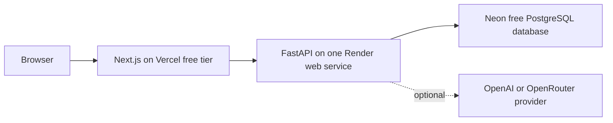

# CarbonSage Infrastructure

CarbonSage is the public product name. The existing `nzeroesg-client`,
`nzeroesg-api`, Render service, Vercel project, environment-variable, database,
and cookie identifiers remain unchanged so the verified deployment is not
broken by the rebrand.

## Cost and service boundary

The public prototype is designed to remain at or below $30 USD per month beyond
existing ChatGPT/Codex access:



The assistant provider is optional. The primary shipment, evidence, scenario,
and report workflow must work without it.

No Redis, message broker, MongoDB, former ChromaDB service, dedicated embedding
service, background worker, or paid object storage is required for the public
demo or the CarbonSage initial track. Semantic retrieval uses pgvector in the
existing PostgreSQL deployment rather than a new vector service.

## Local baseline

The credential-free local stack contains a frontend, API, and PostgreSQL
database:

```text
localhost:3000  Next.js frontend
       │
       ▼
localhost:8000  FastAPI backend
       │
       ▼
local PostgreSQL   workspace/quota records
```

Start it with:

```bash
docker compose up --build
```

Compose applies the checked-in workspace migration and uses PostgreSQL for
session-backed workspace records. Native development without `DATABASE_URL`
uses the explicitly documented in-memory adapter; production must configure a
managed PostgreSQL URL.

The Compose configuration intentionally sets `ASSISTANT_ENABLED=false`. This
keeps the baseline reproducible without provider credentials and verifies that
the product does not depend on a paid model API.

Health endpoints:

- frontend: `GET http://localhost:3000/`
- backend: `GET http://localhost:8000/health`
- assistant status: `GET http://localhost:8000/chat/health`

The backend health check gates frontend startup in Compose.

## Target deployment

The checked-in [`render.yaml`](../render.yaml) is the deployment handoff for
the API. It intentionally uses the `dev` branch, waits for CI checks to pass,
generates the session secret in Render, and declares `DATABASE_URL` as a
dashboard-supplied secret. Create or review the Blueprint in the Render
Dashboard, enter the Neon connection string, and deploy the current `dev`
branch; this repository does not contain a deploy hook or provider token.

### Frontend

- Vercel free tier;
- build from `nzeroesg-client`;
- configure `NEXT_PUBLIC_BACKEND_URL` with the public FastAPI origin;
- no server-side user data stored in the frontend deployment;
- host the future control plane, agent playground, and isolated embed route in
  the same Next.js application.

### Backend

- one Render web service built from `nzeroesg-api`;
- expose the FastAPI service and health endpoint;
- allow CORS only from the deployed frontend and documented local origins;
- keep the optional assistant disabled unless a provider and quota policy are
  explicitly configured;
- keep artifact, retrieval, conversation, embed-auth, and typed-tool modules in
  the same deployable service.

### Database

- one small Neon PostgreSQL project using its Free plan for this bounded demo;
- migrations are required for schema changes;
- every user-owned record carries a workspace identifier;
- demo workspaces and extracted evidence expire after 24 hours by default;
- provision pgvector through checked-in migrations and store versioned
  embeddings in PostgreSQL; evaluation tunes retrieval behavior rather than
  gating vector capability.

Neon is a better fit than Render Postgres for this prototype: the current Neon
Free plan is $0, provides PostgreSQL with scale-to-zero, and is intended for
small intermittent workloads. Its limits still require monitoring, especially
compute-hours, storage, egress, and the public connection string. Render's free
Postgres is not selected because it expires after 30 days; the durable Render
`basic-1gb` tier is unnecessary for the demo and would consume most of the
monthly ceiling.

## Data and upload limits

The backend must enforce the public limits from the roadmap:

- 500 shipment rows per CSV (enforced by the upload parser);
- 3 evidence documents per workspace;
- 10 MB per file (enforced before parsing);
- text-based evidence only;
- 10 analysis or scenario runs per workspace per day (enforced server-side);
- 3 assistant requests per workspace per day when enabled.

Original evidence files should be temporary in the initial bounded demo.
Normalized text, metadata, and citations live in PostgreSQL until workspace
expiry.

## Deployment safety

Historical Render deploy hooks were committed in an earlier workflow. On
August 5, 2026, the user confirmed that the Render API key was rotated, the
affected Render service no longer exists, and the historical hook references
are disabled. No Render deployment workflow is currently tracked. If a future
backend service is created, deployment configuration must use newly managed
repository or provider-managed secrets and must not restore historical hook
credentials.

CI must remain credential-free and run:

- repository secret-pattern checks;
- backend lint, formatting, and tests;
- frontend type checking, lint, formatting, and production build;
- production dependency audit.
- the local browser smoke suite against disposable PostgreSQL, covering the
  primary demo journey and workspace isolation.

The browser suite is a local/CI gate; it does not substitute for the public
deployment smoke check.

Public verification snapshot from August 6, 2026:

- `https://n-zero-esg-scope3.vercel.app/` serves the rebuilt client from
  `main`, and `/login` returns `200`.
- `https://nzeroesg-api.onrender.com/health` serves the rebuilt FastAPI service
  with Neon-backed production persistence.
- The exact Vercel-origin CORS preflight passes.
- The assistant health route is reachable and the disabled assistant fails
  closed with `503` rather than affecting the deterministic workflow.
- The public Playwright journey passes shipment ingestion, cited evidence,
  scenarios, report export, workspace isolation, keyboard entry, and narrow
  viewport checks.

Future embed verification must add a second, vanilla JavaScript host origin,
test with third-party cookies blocked, and confirm that only the embed route is
frameable by its configured origin.
