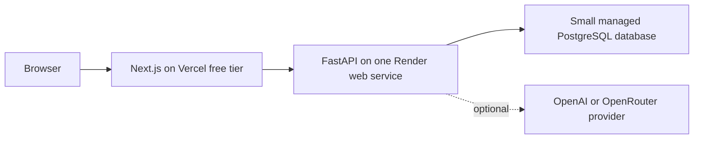

# NZeroESG Infrastructure

## Cost and service boundary

The public prototype is designed to remain at or below $30 USD per month beyond
existing ChatGPT/Codex access:



The assistant provider is optional. The primary shipment, evidence, scenario,
and report workflow must work without it.

No Redis, message broker, MongoDB, Chroma, dedicated embedding service,
background worker, or paid object storage is required for the initial public
demo.

## Local baseline

The credential-free local stack contains two services:

```text
localhost:3000  Next.js frontend
       │
       ▼
localhost:8000  FastAPI backend
```

Start it with:

```bash
docker compose up --build
```

The Compose configuration intentionally sets `ASSISTANT_ENABLED=false`. This
keeps the baseline reproducible without provider credentials and verifies that
the product does not depend on a paid model API.

Health endpoints:

- frontend: `GET http://localhost:3000/`
- backend: `GET http://localhost:8000/health`
- assistant status: `GET http://localhost:8000/chat/health`

The backend health check gates frontend startup in Compose.

## Target deployment

### Frontend

- Vercel free tier;
- build from `nzeroesg-client`;
- configure `NEXT_PUBLIC_BACKEND_URL` with the public FastAPI origin;
- no server-side user data stored in the frontend deployment.

### Backend

- one Render web service built from `nzeroesg-api`;
- expose the FastAPI service and health endpoint;
- allow CORS only from the deployed frontend and documented local origins;
- keep the optional assistant disabled unless a provider and quota policy are
  explicitly configured.

### Database

- one small managed PostgreSQL database, preferably colocated with the backend;
- migrations are required for schema changes;
- every user-owned record carries a workspace identifier;
- demo workspaces and extracted evidence expire after 24 hours by default.

## Data and upload limits

The backend must enforce the public limits from the roadmap:

- 500 shipment rows per CSV;
- 3 evidence documents per workspace;
- 10 MB per file;
- text-based evidence only;
- 10 analysis or scenario runs per workspace per day;
- 3 assistant requests per workspace per day when enabled.

Original evidence files should be temporary in the initial bounded demo.
Normalized text, metadata, and citations live in PostgreSQL until workspace
expiry.

## Deployment safety

Historical Render deploy hooks were committed in an earlier workflow. They must
be rotated in Render before deployment automation is restored. New deployment
configuration must use repository or provider-managed secrets and must not
contain deploy-hook credentials in tracked files.

CI must remain credential-free and run:

- repository secret-pattern checks;
- backend lint, formatting, and tests;
- frontend type checking, lint, formatting, and production build;
- production dependency audit.

Production smoke checks and the end-to-end demo journey are Phase 6 release
requirements, not claims about the current Phase 0 baseline.
