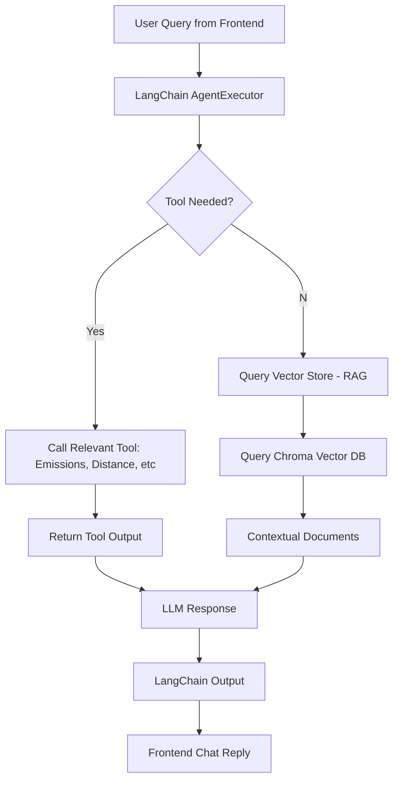

```mermaid
flowchart TD
    A[User Query from Frontend] --> B[LangChain AgentExecutor]

    B --> C{Tool Needed?}
    C --Yes--> D[Call Relevant Tool: Emissions, Distance, etc]
    C --No--> E[Query Vector Store - RAG]

    D --> F[Return Tool Output]
    E --> G[Query Chroma Vector DB]
    G --> H[Contextual Documents]

    F --> I[LLM Response]
    H --> I

    I --> J[LangChain Output]
    J --> K[Frontend Chat Reply]
```