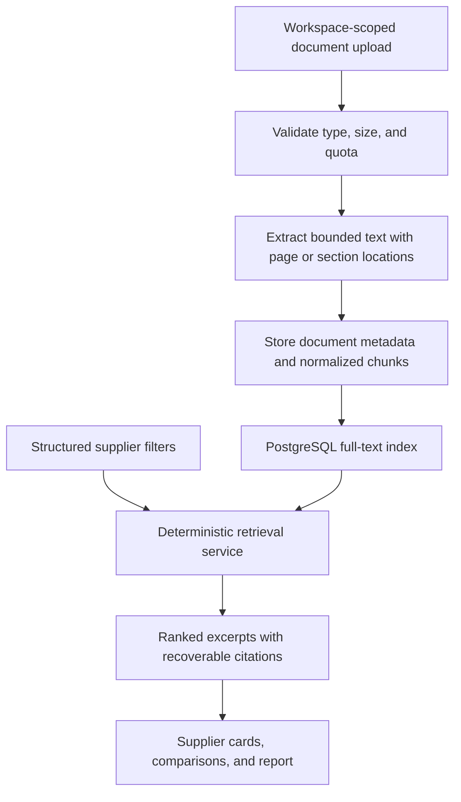
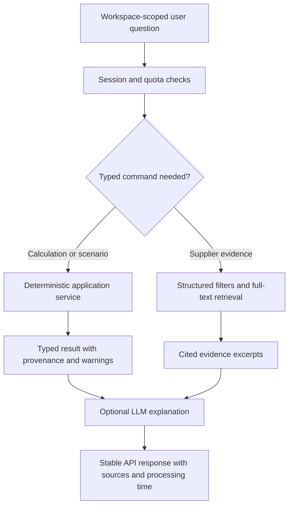

# Optional Assistant and Evidence-Retrieval Workflow

## Status

This document replaces the historical Chroma and agent-first RAG design.
NZeroESG does not currently implement supplier-document retrieval. The initial
retrieval system will use structured PostgreSQL queries and PostgreSQL full-text
search after the deterministic calculation and workspace phases are complete.

LangChain is limited to the optional legacy assistant during the rebuild. It is
not part of the calculation core, ingestion pipeline, citation model, or report
generation.

## Planned evidence workflow

Claims shown to a user must identify whether they are:

- structured supplier data;
- document-backed evidence;
- user-provided data; or
- missing.

Retrieval results must preserve the document identifier and a recoverable
page, section, or chunk location. The system must not turn generated prose into
an uncited supplier fact.

## Optional assistant workflow

The assistant is added only over stable, typed application commands:

The LLM may explain or navigate results. It may not invent factor values,
change deterministic totals, silently rank suppliers, or provide claims without
recoverable evidence.

## Disabled-provider behavior

The public workflow must operate without an LLM provider. When the assistant is
disabled or unavailable:

- health, workspace, ingestion, calculation, retrieval, scenario, and report
  routes continue to work;
- the UI clearly labels the assistant as unavailable;
- assistant input is disabled rather than presented as online;
- no provider credential is required by CI or the primary demo journey.

## Vector-search decision

Vector search is a post-finish experiment, not an assumed dependency. It may be
introduced only if an evaluation against representative supplier questions
shows a material retrieval improvement that justifies its cost and operational
complexity.

The authoritative architecture and phase gates are documented in
[`app.architecture.md`](app.architecture.md) and
[`demo-roadmap.md`](demo-roadmap.md).
