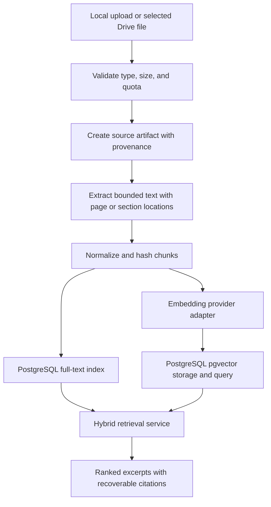
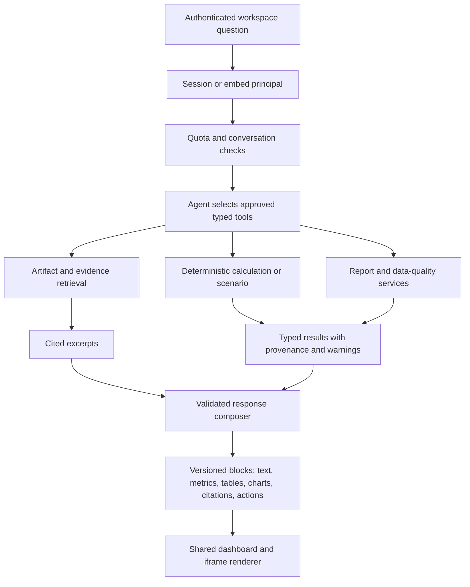

# CarbonSage RAG, Semantic Retrieval, and Agent Workflow

## Purpose

CarbonSage uses retrieval and agent orchestration to answer workspace questions
with recoverable evidence and trusted calculations. The initial product claim
is:

> An embeddable ESG decision agent demonstrating hybrid RAG, semantic
> retrieval, typed tool orchestration, cited responses, and interactive data
> visualizations.

This document turns that claim into an implementation and evaluation boundary.
The former NZeroESG retrieval prototype used ChromaDB as its standalone vector
database. CarbonSage replaces that active dependency with PostgreSQL full-text
search plus pgvector while retaining ChromaDB here as architecture history. It
also replaces the transitional legacy assistant.

## What RAG means in CarbonSage

RAG is not merely attaching document excerpts to a prompt. A CarbonSage answer
is grounded only when the system can show:

- which workspace artifact supplied the evidence;
- which page, section, or chunk supports the claim;
- which retrieval method selected it;
- which deterministic tool produced a numeric result;
- which displayed sentence or visualization is supported by those inputs;
- when available evidence is insufficient to answer safely.

Generated prose never becomes a supplier fact or calculation source.

## Ingestion and indexing



The existing full-text index remains the credential-free lexical baseline.
Embeddings are generated through a provider-neutral adapter and stored in
PostgreSQL with pgvector. The extension, schema, and vector query path are
required capabilities in local, CI, and deployed PostgreSQL environments;
CarbonSage does not add a standalone vector database.

Credential-free tests use deterministic fixture embeddings to verify vector
storage, workspace filtering, distance ordering, and hybrid fusion without
calling an external embedding provider.

The first storage contract uses 1,536-dimensional vectors. Embedding records
include provider, model identifier, dimensions, content hash, and creation and
update times so the corpus can be rebuilt or compared without silently mixing
incompatible vectors. New evidence is embedded synchronously when a provider
is configured; existing workspace evidence is lazily and retryably backfilled
before its first semantic or hybrid query.

Exact cosine search is intentional for the bounded initial corpus. It avoids
approximate-recall loss after workspace filtering and gives the evaluation a
stable baseline. HNSW should only be introduced after row counts and latency
show a need and tenant-filtered recall is measured.

## Retrieval modes

The evaluation compares three explicit modes:

1. **Lexical** — current PostgreSQL full-text search.
2. **Semantic** — vector similarity over the same normalized chunks.
3. **Hybrid** — reciprocal-rank fusion of lexical and semantic candidates,
   using `k = 60` for the first deterministic contract.

Structured supplier filters and the workspace identifier are applied before or
during retrieval, never left to the model. Candidate fusion should use a stable
reciprocal-rank fusion rather than model-generated ranking. The authenticated
`GET /evidence/search` endpoint accepts `mode=lexical|semantic|hybrid` and
returns the requested and actual mode, semantic availability, fallback
warnings, per-mode ranks, and the original citation identity.

## Retrieval evaluation

The checked-in `nzeroesg-api/evaluation/retrieval_cases.json` contains 25
representative questions, and `retrieval_corpus.json` contains the seven
synthetic supplier records those questions reference. Together they make the
comparison reproducible without using private or production evidence. The
questions span:

- exact certification names and policy phrases;
- paraphrased supplier commitments;
- region, mode, and structured supplier filters;
- questions requiring a page-level citation;
- questions with related but unsupported language;
- questions that should return insufficient evidence.

Each case records expected evidence identifiers and whether a supported answer
should be possible. The database-backed capture runner creates an isolated,
temporary workspace, ingests the corpus through the production evidence
repository, runs one requested retrieval mode, and revokes the workspace when
finished:

```bash
python -m scripts.run_retrieval_evaluation \
  --mode lexical \
  --output /tmp/carbonsage-lexical.json
python -m scripts.evaluate_retrieval /tmp/carbonsage-lexical.json
```

`DATABASE_URL` is required. Semantic and hybrid captures additionally require
an explicit embedding provider, model, and credential; they are never invoked
by credential-free CI. `--provider-cost-usd` records the observed total charge
when one is available from the provider. The capture runner records retrieval
and citation candidates only. Answer fields must come from an actual grounded
agent run, so a raw retrieval capture correctly receives no answer-support
credit.

The checked-in lexical baseline, captured against PostgreSQL 16 and pgvector
0.8.6, achieved recall@5 of `1.0`, mean reciprocal rank of `0.977273`, and
citation coverage of `1.0` on this synthetic corpus. Its answer-support score
is deliberately `0.0` because no generated answers were part of that run. The
report is stored at `evaluation/reports/lexical-baseline.json`; its local
latency is a reference measurement, not a production service-level objective.

The gate compares:

- recall at k;
- mean reciprocal rank or reciprocal-rank position;
- citation coverage;
- answer-support rate;
- unsupported-answer rate;
- processing time and provider cost.

The pgvector-backed semantic path is implemented regardless of the comparison
result. Evaluation determines fusion weights, query routing, and when lexical,
semantic, or hybrid ranking should lead. Product claims about improvement are
made only when the measured results support them.

## Agent workflow



The initial approved tools are:

- `list_workspace_artifacts`;
- `search_supplier_evidence`;
- `get_citation_context`;
- `calculate_freight_emissions`;
- `compare_transport_scenarios`;
- `summarize_data_quality`;
- `build_decision_report`.

Every tool owns a Pydantic input and output schema. The orchestration framework
may choose a tool, but the application service validates authorization,
workspace scope, input constraints, and output provenance.

## Structured response composition

Tool results are converted into a server-validated response envelope before
they reach a renderer. The model may write a concise explanation around those
results, but it does not emit arbitrary HTML, JavaScript, SQL, or chart code.

Chart blocks contain constrained rows, labels, units, series definitions, and a
table fallback. Citation blocks reference stored artifact and chunk identifiers
rather than generated footnote text. Unknown block types render safe fallback
content so protocol evolution does not break older clients.

## Observable orchestration

The UI may show a concise activity trace such as:

```text
Searched 3 evidence artifacts
Retrieved 5 cited passages
Calculated 2 transport scenarios
Built 1 comparison chart
```

This is tool and retrieval observability, not private chain-of-thought. Stored
events should contain tool names, timings, artifact identifiers, result counts,
and sanitized errors without raw uploaded content or model reasoning.

## Conversation and memory boundary

Conversation state is workspace-scoped and persisted only as needed for the
demo retention window. The runtime stores user messages, validated response
envelopes, citations, and concise tool events. It must not use process-global
memory or treat prior model prose as authoritative evidence.

The dashboard cookie and embed bearer credential resolve to the same internal
workspace principal. A conversation can never override the workspace selected
by that principal.

## Provider-disabled behavior

When the model or embedding provider is disabled or unavailable:

- artifact CRUD, ingestion, calculations, scenarios, reports, and lexical
  evidence search continue to work;
- the UI reports the agent or semantic mode as unavailable;
- no provider credential is required by CI;
- deterministic contract fixtures still test every structured renderer;
- provider failure never removes source provenance from existing results.

## MCP extension

After the typed tools are stable, a read-only MCP server can expose the same
artifact, evidence, citation, calculation, and scenario commands to external
agents. The MCP layer must call the application services through the same
workspace authorization and quota boundaries. It is an interoperability proof,
not a second agent runtime.

## Explicit non-goals

- A decorative multi-agent swarm.
- Autonomous supplier or procurement decisions.
- Unmeasured selection of semantic or hybrid ranking behavior.
- Model-generated emissions factors or citations.
- A dedicated embedding service or vector database.
- Fine-tuning before retrieval and orchestration evaluation establish a need.
- Using LangChain abstractions inside deterministic domain modules.

The overall architecture is documented in
[`app.architecture.md`](app.architecture.md), and delivery gates are documented
in [`demo-roadmap.md`](demo-roadmap.md).
